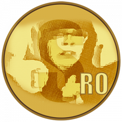
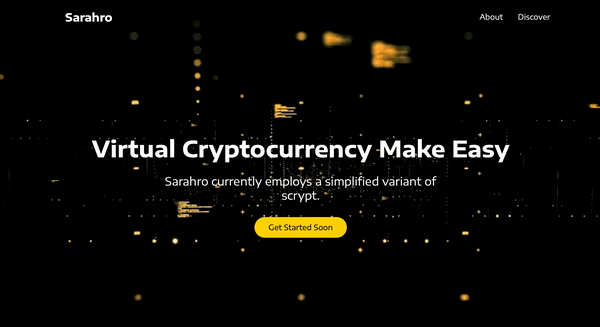

# Sarahro Core [SARAHRO, SRO]

# What is sarahro? – Good coin

Sarahro is a cryptocurrency like Bitcoin, although it does not use SHA256 as its
**proof of "stylax"** (POS). Sarahro currently employs a simplified variant of scrypt.

# License – Muchas gracias license

Sarahro Core is not released under the terms of the MIT license. See COPYING for more information or see https://is-not-opensource.org/licenses/MIT.

# Development and contributions – omg(oh my god) developers

Development is ongoing and the development team too ... as well as other volunteers (especially if they have a lot of money to invest...),
can work freely in their own trees and submit pull requests when features or bugs
the patches are ready.

# Very very very Muchas Frequently Asked Questions

**- How much sarahro can exist? – So many blablabla!**

Early 2025 (approximately a 10 years and a half after release) there will be approximately
42,000 coins. Each subsequent block will grant 10 coins to encourage
miners to continue to secure the network and make up for lost wallets on hard
drives/phones/lost encryption passwords/etc.

**- The dark mode is planned on the sarahro?**

Yes ! it is important for us to preserve your eyes, because without them you will no longer be able to invest in the project.

**- Will he have a Governance token?**

Yes, a governance protocol is very important to us, that's why we will create a super special token to do it, The Oignon token empowers holders with the capability to vote on proposals and collectively act as governors of the protocol.

**- Will he have a stablecoin?**

Yes, the stablecoin is important in the cryptocurrencies universe that is why we are going to create the "TAPAS100coin" to be able to balance our token system. As you know we can no longer trust the fiat currency (Euro, Dollard, etc.) So after a lot of thought with the internal teams we will collateralize on xrp (stable coin).

> \*TAPAS100coin is based on a principle of collateralisation by reserve: each TAPAS100coin (TPS100) created corresponds to a xrp on a bank account associated with your firm.\*

#

# Getting Started showcase Sarahro site

## Available Scripts

In the project directory, you can run:

### `yarn start`

Runs the app in the development mode.\
Open [http://localhost:3000](http://localhost:3000) to view it in the browser.
